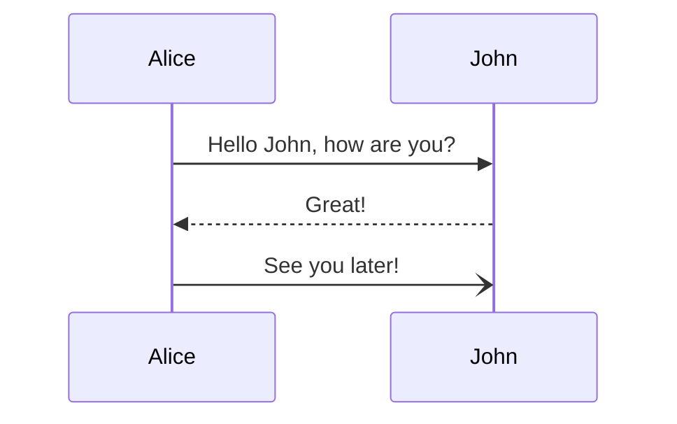
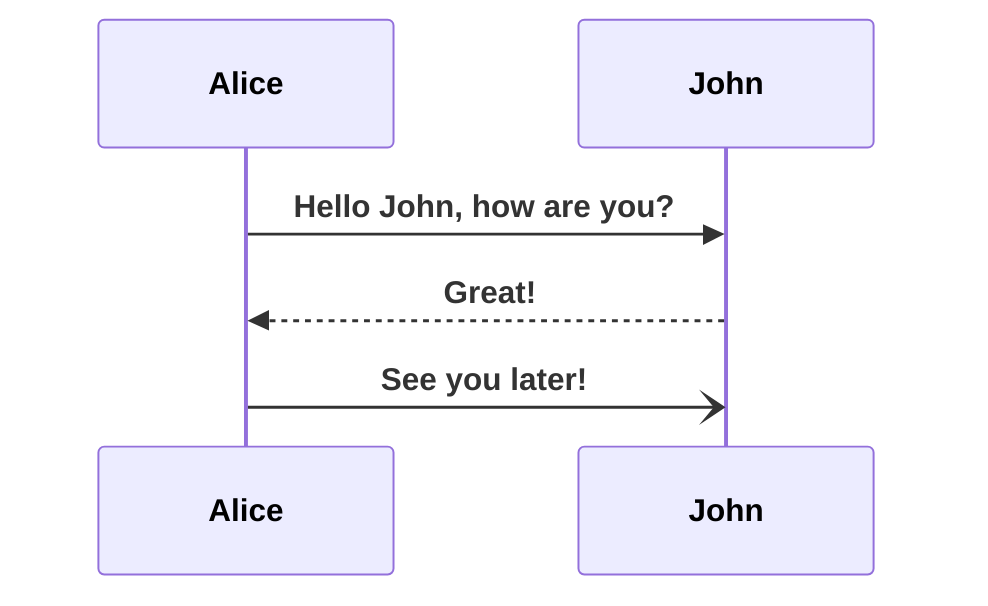

# mermaid-pg
Mermaid Playground

Found a customization sample for mermaid [here](https://stackoverflow.com/questions/71864287/mermaid-custom-css-scripts-in-markdown).

[start snippet]
I am in a Markdown file and I want to show you a diagram:

```mermaid
%%{
  init: {
    "sequence": {
      "actorFontFamily": "monospace",
      "actorFontWeight": "bold",
      "messageFontFamily": "monospace",
      "messageFontWeight": "bold",
      "noteFontWeight": "bolder"
    }
  }
}%%

sequenceDiagram
  participant Browser
  participant AppServer

  rect rgb(255, 255, 255, 0.05)
    note over Browser, AppServer: (Phase 1) Authentication Check

    Browser ->> AppServer: GET /admin { Cookie:  }
    Browser ->> Browser: useSession
  end
end
```
[end snippet]

Leads to an error, let's try one of the [examples](https://mermaid.js.org/syntax/sequenceDiagram.html) from the docs:



GitHub doesn't state where the error in the first diagram is... let's start by trying to add an init.


Nice, the font is bolded! The next question is how custom can we get with mermaid?
